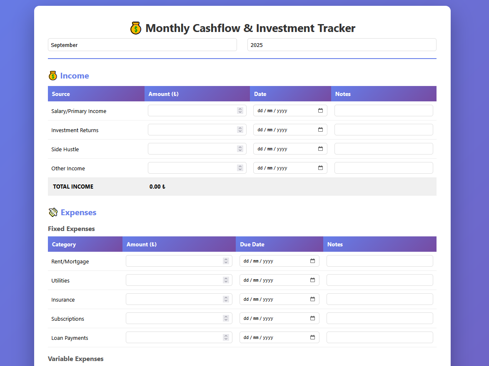
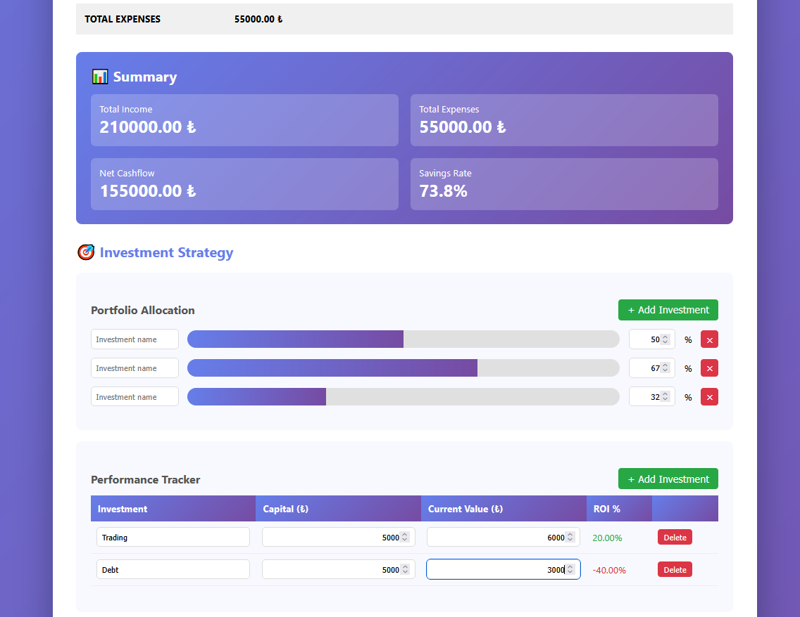

# 💰 Monthly Cashflow & Investment Tracker

A simple, beautiful, and printable HTML-based personal finance tracker for managing monthly cashflows and investment strategies.

*Track your income sources and categorize expenses*

*Manage portfolio allocation and monitor investment performance*

## ✨ Features

- **Real-time Calculations**: Automatic totals, net cashflow, savings rate, and ROI calculations
- **Visual Portfolio Allocation**: Interactive progress bars to visualize your investment distribution
- **Customizable Investments**: Add, edit, or remove investment categories with the + button
- **Print-Ready**: Clean, professional print layout for physical records
- **No Backend Required**: Pure HTML/CSS/JS - works offline, no installation needed
- **Privacy First**: All data stays in your browser, nothing is sent to any server

## 🚀 Quick Start

1. Download `cashflow-tracker.html`
2. Open it in any modern web browser
3. Start filling in your income and expenses
4. Add your custom investments using the + button
5. Print or save when done!

## 📸 Screenshots

### Income & Expenses
The tracker provides a clean interface to log all your income sources and categorize expenses into fixed and variable costs.

### Investment Strategy
Visualize your portfolio allocation with interactive progress bars and track the performance of each investment with automatic ROI calculations.

*To add screenshots to your repository:*
1. Create a `screenshots` folder in your GitHub repo
2. Upload your images as `income-expenses.png` and `investment-strategy.png`

## 📊 What You Can Track

### Income Sources
- Salary/Primary Income
- Investment Returns
- Side Hustles
- Other Income Sources

### Expenses
- **Fixed**: Rent, utilities, insurance, subscriptions, loans
- **Variable**: Groceries, transportation, dining, entertainment, healthcare, shopping
- **Investment Outflows**: Capital allocated to various investments

### Investment Strategy
- Portfolio allocation visualization
- Performance tracking with ROI calculations
- Recommended strategies (Three-Bucket, DCA, Rebalancing)
- Monthly action items and goal setting

## 🎯 Use Cases

- Personal monthly budgeting
- Freelancer income/expense tracking
- Small business cashflow management
- Investment portfolio monitoring
- Financial goal planning

## 💡 Tips

- **Monthly Routine**: Fill this out at the beginning of each month with your budget, and update throughout the month
- **Print Archive**: Print completed months and keep them in a binder for year-over-year comparison
- **Goal Setting**: Use the "Monthly Goal" section to set specific targets and track progress
- **Investment Strategy**: Review the recommended strategies and adapt them to your risk tolerance

## 🛠️ Customization

The tracker is built with clean, commented code. Feel free to:
- Modify expense categories in the HTML tables
- Adjust the color scheme in the CSS (search for `#667eea` and `#764ba2` for the primary gradient)
- Add more investment strategies in the strategy section
- Customize the allocation percentages

## 📱 Browser Compatibility

Works on all modern browsers:
- Chrome/Edge (recommended)
- Firefox
- Safari
- Opera

## 🤝 Contributing

Contributions are welcome! Feel free to:
- Submit bug reports
- Suggest new features
- Improve documentation
- Share your customizations

## 📄 License

MIT License - feel free to use, modify, and distribute as you wish.

## 🌟 Support

If you find this useful, please:
- ⭐ Star this repository
- 🐛 Report bugs or suggest features via Issues
- 🔀 Fork and customize for your needs
- 📢 Share with others who might benefit

---

**Made with ❤️ for better financial awareness**